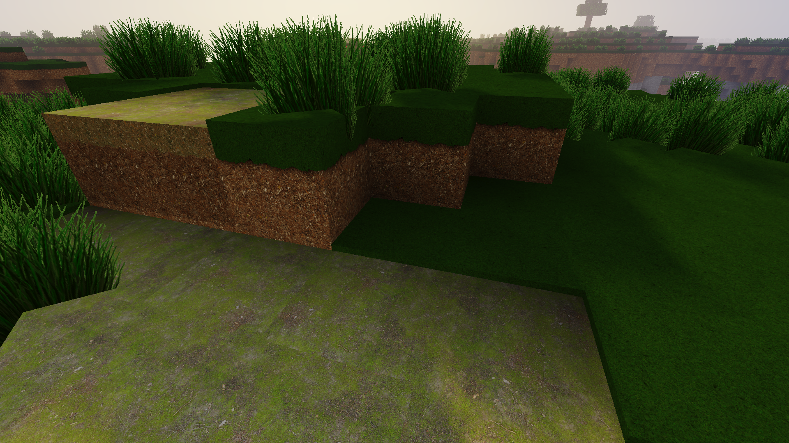
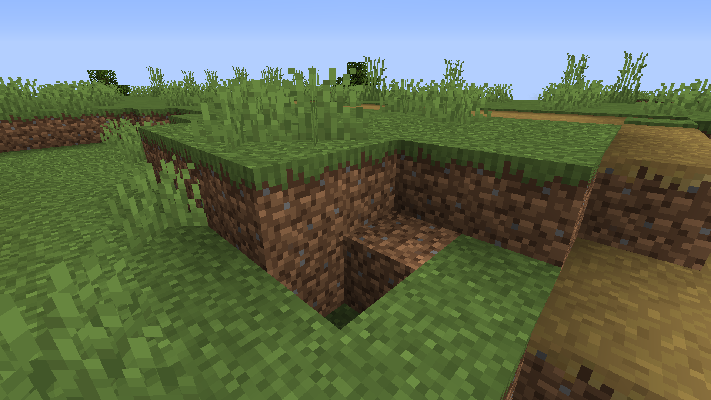

# **Go Real - Photorealistic Minecraft Texture Pack**  
### **Transform Minecraft into a Stunning Visual Masterpiece**  

  

Welcome to **Go Real**, a custom **photorealistic texture pack for Minecraft** designed to elevate the game's visuals to an entirely new level! 🌟 With **realistic textures**, **PBR (Physically-Based Rendering)** support, and compatibility with popular shaders, this texture pack brings Minecraft to life with breathtaking detail.

## 🚀 **Features**  
- **Photorealistic Textures:** High-resolution textures that give blocks a lifelike appearance.  
- **PBR Support:** Enhanced visuals for reflections, lighting, and shadows with compatible shaders.  
- **Vanilla-Friendly Design:** Retains the charm of **vanilla Minecraft** while upgrading its aesthetics.  
- **Open Source:** Completely free and open to modifications.  

---

## 🎮 **Requirements**  
To get the best experience with this texture pack, make sure you have the following:  
1. **Minecraft Java Edition** (1.XX version supported; update as needed).  
2. A shader pack like **SEUS PTGI**, **BSL Shaders**, or **Continuum** for PBR effects.  
3. A decent GPU for smooth performance with high-resolution textures.  

---

## 🛠️ **Installation**  
Follow these simple steps to install the texture pack:  

1. **Download the ZIP File**  
   - [Click here to download](https://github.com/ghgltggamers/go-real---Open-Source-RP-MC-/archive/refs/heads/main.zip)  

2. **Install the Texture Pack**  
   - Open Minecraft and go to `Options > Resource Packs`.  
   - Drag and drop the downloaded ZIP file into the resource pack window.  

3. **Activate the Pack**  
   - Select the **Go Real** texture pack from the list and click "Done."  
   - Restart Minecraft for the best performance.  

4. **Optional: Install Shaders**  
   - For the best visuals, install a shader pack and enable PBR support.  

---

## 📷 **Preview**  
Check out these before-and-after screenshots comparing **vanilla Minecraft** with **Go Real** texture pack:  

| Vanilla Minecraft | Go Real Texture Pack |  
|-------------------|----------------------|  
|  |  |  

---

## 💻 **Contributing**  
This project is open-source and thrives on contributions!  
- Found a bug or visual glitch? [Report it here]().  
- Want to add your own textures or improve existing ones? Fork the repo and submit a pull request!  

---

## 📜 **License**  
This project is licensed under the **MIT License**. Feel free to use, modify, and share it as long as you give proper credit.  

---

## 🤝 **Acknowledgments**  
- Special thanks to the **Minecraft community** for endless inspiration.  
- Shader packs like **SEUS** and **BSL** for bringing out the best in this texture pack.  

---

## 📢 **Feedback**  
Have suggestions or feedback? Feel free to comment on this repository or reach out through [social media](https://www.youtube.com/@ghgltggamer).
